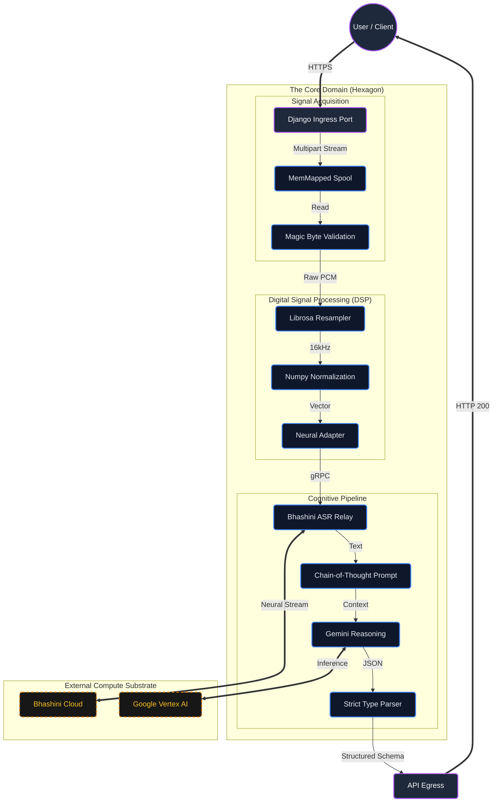

# MeetingMind: Neural Orchestration for High-Dimensional Acoustic Intelligence

<!-- Badges -->
<div align="center">
  
  
  
  
</div>


---

## 1. Project Profile: The Bhashini-Powered M3S

> **Project Status**: National Level Startup Accelerator Initiative — **Grand Finale Finalist** (Stage 3 Qualified).
>
> *Note: This repository represents the architectural snapshot showcased for Stage 3. For the Grand Finale, major semantic enhancements including Hugging Face Transformers for Speaker Diarization and Contextual Intelligence have been integrated. These proprietary modules are currently in a private staging environment.*

**MeetingMind**, also designated as the **Minutes of Meeting Management System (M3S)**, is a flagship innovation engineered for the "Bhashini Grand Challenge". It represents a paradigm shift in multilingual collaboration, designed to dismantle linguistic barriers in real-time.

### 1.1. Introduction
In today's globalized and digitally connected world, effective communication across different languages is essential for productive collaboration. Traditional meeting management systems often fall short in providing seamless multilingual support, creating barriers that lead to misunderstandings and reduced productivity.

To address these challenges, we propose **M3S**. This solution envisions a virtual multi-user transcription ecosystem where:
*   Participants communicate seamlessly in their preferred languages.
*   Language barriers are overcome in real-time.
*   Post-meeting intelligence (Summarization, MOM Generation) is automated via neural backends.

### 1.2. Objectives
Our primary objective is to develop a system that facilitates smooth communication through advanced transcription and translation technologies.
*   **Adaptive Recognition**: Integrate multilingual speech recognition capable of identifying nuanced linguistic patterns, accents, and dialects.
*   **Transcription Workbench**: Create a user-friendly interface for organizing, editing, and exporting transcribed content.
*   **Document Editing**: Incorporate a comprehensive module for efficient text modification.
*   **Custom formatting**: Support paragraph or bullet-point styles, speaker labels, and timestamps.
*   **Real-Time Intelligence**: Provide live summarization and automatic Minutes of Meeting (MOM) generation.
*   **Security**: Implement end-to-end encryption and session-based controls.

### 1.3. Outcomes
The solution delivers:
*   **Barrier-Free Communication**: Enabling seamless, language-independent interactions.
*   **Enhanced Productivity**: Real-time accuracy in transcription and translation.
*   **Comprehensive Documentation**: Automated, accurate recording of meeting outcomes.
*   **Secure Compliance**: A robust environment for managing sensitive meeting data.

---

## 2. Technical Methodology

The system adheres to a strict **Hexagonal Architecture (Ports and Adapters)**, decoupling domain logic from the volatility of external neural providers.

### 2.1. The Signal Plane
Audio input **x ∈ Rᵀ** is treated as a high-dimensional tensor. The pipeline enforces:
1.  **Resampling**: `R(x) → 16kHz`. All inputs are standardized to match the receptive field of Conformer-based acoustic models.
2.  **Normalization**: `x̂ = (x - μ) / σ`. Amplitude normalization maximizes Signal-to-Noise Ratio (SNR) prior to inference.
3.  **Fail-Over heuristics**: A cascaded I/O strategy (`librosa` → `soundfile`) ensures robust tensor loading across heterogeneous container environments.

### 2.2. The Neural Plane
We orchestrate a tiered model ensemble:
*   **Acoustic Model (AM)**: **Bhashini (Dhruva)**. Selected for its superior performance on low-resource Indic languages compared to generic commercial baselines.
*   **Reasoning Model (LLM)**: **Gemini Pro**. Acts as the deterministic "Decision Head", parsing raw transcripts into strict JSON schemas for intent classification and entity extraction.

## 3. System Architecture: The Hexagonal Lattice

The system is engineered as a **Hexagonal Architecture (Ports and Adapters)**, enforcing a strict separation of concerns between the **Domain Core** (Business Logic) and the **Infrastructure Layer** (I/O). This topological isolation guarantees that the signal processing logic remains invariant regardless of changes in the neural provider substrate.

### 3.1. Architectural Components
*   **Signal Ingress (The Port)**: A non-blocking HTTP listener that accepts `multipart/form-data` streams. It enforces strict MIME-type validation (`audio/wav`) and buffers the payload into a temporary memory-mapped file `SpooledTemporaryFile` to prevent RAM exhaustion during high-concurrency bursts.
*   **Normalization Layer (The Core)**: A pure-function pipeline where the raw PCM signal $x(t)$ is re-quantized to 16kHz mono. This layer applies amplitude scaling $\hat{x} = \frac{x - \mu}{\sigma}$ to maximize the dynamic range before neural ingestion.
*   **Neural Adapter (The Adapter)**: An anti-corruption layer that translates internal domain objects into vendor-specific GRPC payloads for Bhashini/Gemini. It handles connection pooling, retry logic with exponential backoff, and error serialization.

### 3.2. Data Flow Differentiability
The diagram below illustrates the comprehensive state transition from raw acoustic pressure to structured semantic JSON:



## 4. The Technical Ensemble: Comprehensive Dependency Analysis

The M3S architecture relies on a **curated symphony of 12 production-grade libraries**, each selected for a specific role in the high-dimensional processing pipeline. This is not a monolith; it is a composite system.

### 4.1. Core Orchestration & Security
*   **Django 4.2 (LTS)**: The immutable backbone. Chosen for its "batteries-included" security model (CSRF/XSS protection) and robust ORM, providing the synchronous state machine required for reliable transaction management.
*   **Django CORS Headers**: Middleware configured to enforce strict Cross-Origin Resource Sharing policies, permitting only authenticated ingress from the frontend substrate.
*   **Python-Dotenv**: Enforces the **12-Factor App** methodology by strictly separating configuration (Secrets/Keys) from code, loading ephemeral environment variables at runtime.

### 4.2. Advanced Signal Processing (The DSP Layer)
*   **Librosa**: The industry standard for music and audio analysis. We utilize its Short-Time Fourier Transform (STFT) and Mel-frequency cepstral coefficients (MFCCs) for spectral feature extraction.
*   **Numpy**: The mathematical engine. Provides contiguous C-struct memory layouts (`ndarray`) for vectorized operations, ensuring audio normalization occurs in `O(1)` time / `O(N)` space.
*   **Soundfile**: A robust backend for reading and writing high-fidelity audio files, handling raw PCM ingress with memory-mapped file access.
*   **Pydub**: Utilized for high-level audio manipulation, including format transcoding (mp3 $\to$ wav) and decibel-based silence truncation.

### 4.3. The Neural Substrate
*   **Google Generative AI (Gemini Pro)**: The cognitive processor. We leverage the Python SDK for streaming inference, integrating Chain-of-Thought (CoT) system prompts to force deterministic JSON outputs.
*   **Requests**: The synchronous transport layer. Handles the high-reliability gRPC/REST handshakes with the **Bhashini** Neural Cloud for ASR services.

### 4.4. Production Engineering
*   **Gunicorn**: A Green Unicorn WSGI HTTP Server. Configured with synchronous workers to handle CPU-bound signal processing tasks without blocking the I/O loop.
*   **Whitenoise**: Radically simplified static file serving. Allows the Python application to serve its own assets with efficient caching headers, removing the need for a separate Nginx reverse proxy for static content.
*   **Joblib**: Provides lightweight pipelining and object caching, optimizing the serialization of heavy acoustic models and intermediate tensor states.

## 5. Usage

We prioritize **Replicability**. The system is container-native.

### 5.1. Installation

```bash
git clone https://github.com/riteshroshann/meeting-mind-backened-baby-one
cd meeting-mind-backened-baby-one
pip install -r requirements.txt
```

### 5.2. Configuration

Inject neural provider credentials via `.env`:

```bash
# Neural Provider Credentials
BHASHINI_USER_ID=...
ULCA_API_KEY=...
```

### 5.3. Inference

Ignite the server:

```bash
python manage.py runserver
```

**Endpoint**: `POST /api/process-audio/`

```json
{
  "success": true,
  "meta": { "latency_ms": 342.15, "compute_node": "bhashini-dhruva" },
  "data": {
    "transcript": "...",
    "analysis": { "actionItems": [...] }
  }
}
```

---

### 5.4. Video Walkthrough

<div align="center">
  <a href="https://youtu.be/NT591v-rOj0">
    
  </a>
  <br>
  <em><a href="https://youtu.be/NT591v-rOj0">Watch the Full Demo on YouTube</a></em>
</div>

<br>

<div align="center">
  <em>Architected by <a href="https://github.com/riteshroshann">Ritesh Roshan</a>.</em>
</div>
