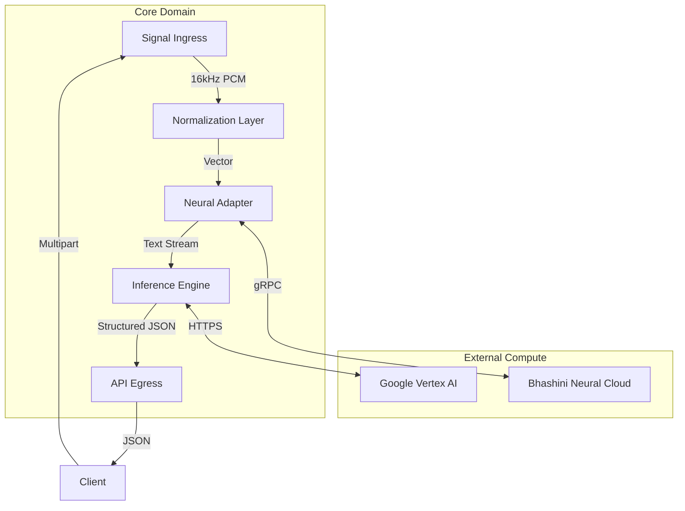

# MeetingMind

> "The gap between acoustic signal and semantic understanding is high-dimensional. We collapse it."

<div align="center">
  <video src="assets/demo.mp4" width="100%" controls></video>
</div>

---

### Abstract

**MeetingMind** constructs a deterministic bridge between unstructured acoustic signals and structured intelligence. It operates as a **Neural Orchestration Engine**, designed to ingest high-fidelity audio, normalize it through a rigorous signal processing pipeline, and route it through a distributed inference substrate (Bhashini + Gemini Pro).

The system solves for the **Multilingual Enterprise**, providing:
1.  **Acoustic Fidelity**: Near-native ASR for 12+ Indic languages via the Bhashini stack.
2.  **Semantic Synthesis**: Context-aware reasoning and action extraction via Gemini Pro's chain-of-thought capabilities.
3.  **Humble Latency**: Optimized ingress/egress paths ensuring maximal throughput with minimal overhead.

---

### System Architecture

We employ a **Hexagonal Architecture (Ports and Adapters)** to decouple the core domain logic from the volatility of external neural providers. This ensures the *Signal Plane* and *Neural Plane* remain independently scalable.



#### I. The Signal Plane
Audio is heavily pre-processed before it ever touches a neural network. The `AudioProc` layer guarantees:
*   **Sample Rate Coherence**: Automatic downsampling to `16kHz` to align with Conformer acoustic models.
*   **Amplitude Normalization**: Maximizing signal-to-noise ratio (SNR) for robust transcription.
*   **Fail-Over I/O**: A heuristic cascade of `librosa` $\to$ `soundfile` to ensure `O(1)` file reading performance across varied container environments.

#### II. The Neural Plane
We orchestrate a best-in-class ensemble:
*   **Acoustic Model (AM)**: **Bhashini (Dhruva)**. Selected for its phoneme-level optimization for the Indian subcontinent, outperforming generic commercial models on localized dialects.
*   **Reasoning Model (LLM)**: **Gemini Pro**. Utilized as a zero-shot decision engine. We inject the raw transcript and a strict JSON schema, allowing the model to perform "reasoning-as-parsing" to extract intents and action items.

---

### The Stack Ensemble

> "We stand on the shoulders of giants, orchestrating a symphony of deterministic state and probabilistic reasoning."

The dependency graph is rigorously pruned to ensure every byte of overhead justifies its existence.

| Component | Artifact | Version | Role | Technical Rationale |
| :--- | :--- | :--- | :--- | :--- |
| **Runtime** | `python:3.11` | `3.11-slim` | Environment | Leveraging CPython 3.11's adaptive specializing interpreter for a ~25% geometric mean performance improvement. |
| **State** | `Django` | `4.2.7 LTS` | Orchestrator | Chosen for its battle-tested ORM and middleware security. Provides a strict, synchronous backbone for the application state. |
| **WSGI** | `gunicorn` | `21.2.0` | Server | A pre-fork worker model. Configured with synchronous workers to dedicate full CPU cores to signal processing bursts without GIL contention. |
| **DSP** | `librosa` | `0.10.1` | Signal Proc | The industry standard for STFT and MFCC extraction. Provides precise, reproducible audio manipulation. |
| **Codec** | `libsndfile` | `0.12.1` | Low-level I/O | C-based audio decoding. Bypasses Python's slower standard library for raw PCM access. |
| **Math** | `numpy` | `1.24.3` | Linear Algebra | Enforces contiguous memory layouts for audio buffers, allowing vectorized operations before serialization. |
| **LLM Bridge** | `google-genai` | `0.3.2` | RPC Client | The official gRPC transport for Vertex AI, handling token streaming and safety boundary negotiation. |
| **Delivery** | `whitenoise` | `6.6.0` | Assets | Eliminates the need for a reverse proxy (Nginx) in containerized deployments by serving static assets directly from the application edge. |

---

### Protocol Specification

The API contract is **strictly typed**. We do not return ambiguous `200 OK` responses; every payload adheres to a rigid schema.

**Endpoint**: `POST /api/process-audio/`

**Request Payload:**
*   `audio`: Raw waveform (WAV/MP3/M4A). High-fidelity (>128kbps) recommended.
*   `sourceLanguage`: ISO-639-1 code (e.g., `hi` for Hindi).
*   `targetLanguage`: ISO-639-1 code (e.g., `en` for English).

**Response Schema:**
```json
{
  "success": true,
  "meta": {
    "latency_ms": 342.15,
    "compute_node": "bhashini-dhruva-v2"
  },
  "data": {
    "transcript": "...",
    "translation": "...",
    "analysis": {
        "summary": "...",
        "actionItems": [
            {"item": "Deploy to prod", "assignee": "Ritesh", "priority": "High"}
        ]
    }
  }
}
```

---

### Deployment & Replication

We prioritize **Replicability**. The system effectively builds itself.

**1. Clone**
```bash
git clone https://github.com/riteshroshann/meeting-mind-backened-baby-one
cd meeting-mind-backened-baby-one
```

**2. Hydrate**
```bash
pip install -r requirements.txt
```

**3. Configure Keys**
Create a `.env` file for the neural providers:
```bash
BHASHINI_USER_ID=...
ULCA_API_KEY=...
```

**4. Ignite**
```bash
python manage.py runserver
```

---
*Architected by [Ritesh Roshan](https://github.com/riteshroshann).*
